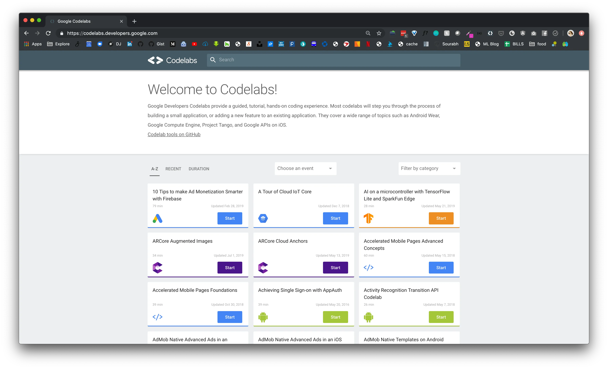
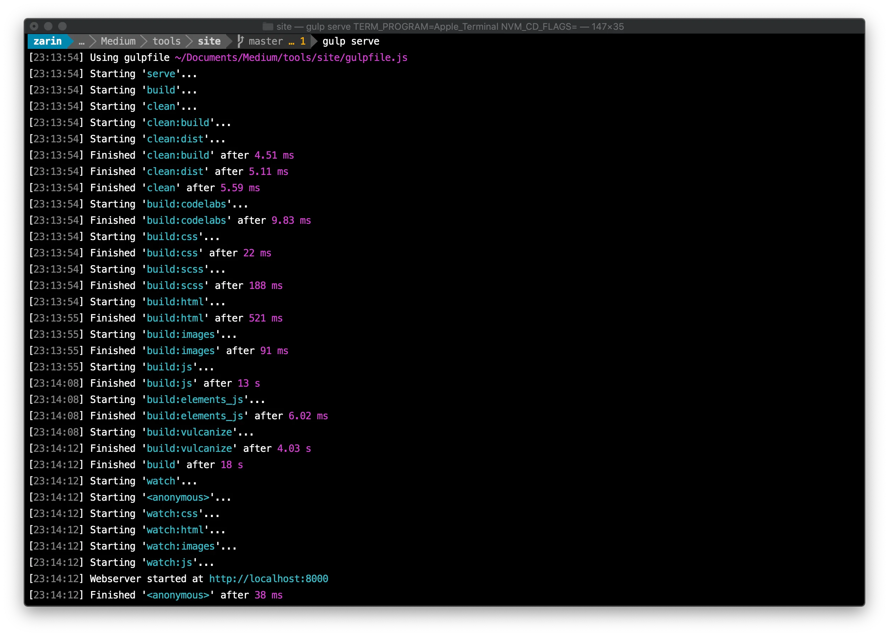
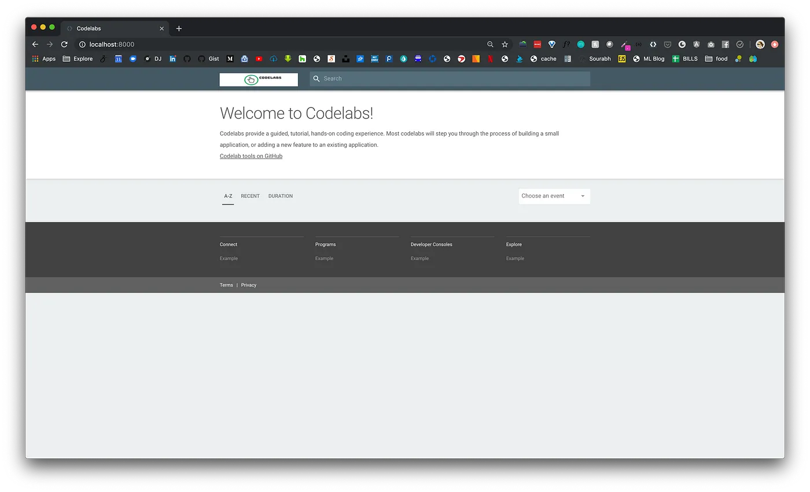
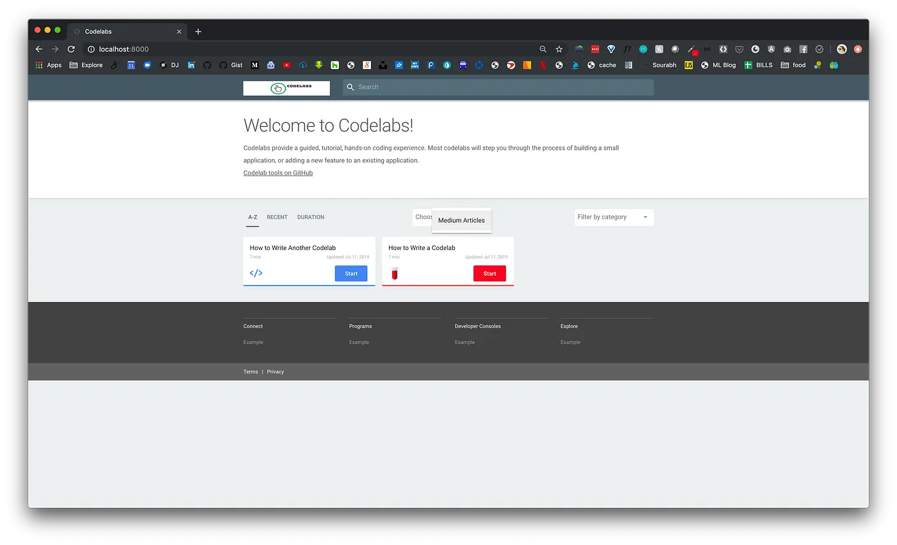

summary: 使用 Google Codelab 编写技术教程
id: publish-technical-tutorials-in-google-godelab-format
categories: codelab
tags: codelab
status: Published
authors: panhy
Feedback Link: https://github.com/webtechwiki/codelabs/issues

# 使用 Google Codelab 格式编写技术教程

## 概述  

Duration: 1

Google Developers Codelab 提供了一种引导式编码实践教程体验。大部分 Codelab 会逐步介绍开发小应用或在现有应用中新增功能的过程。其友好的交互体验，以及丰富的资源，使得 Codelab 成为学习新技能的好方法。Google Codelabs 网站可以通过 <https://codelabs.developers.google.cn/?hl=zh-cn> 网址访问。

当然，因为 Google 开源了这个网站构建工具，我们也可以基于该工具搭建我们自己的 Codelabs。我们要搭建的网站效果如下截图



> 本文参考自: <https://medium.com/@zarinlo/publish-technical-tutorials-in-google-codelab-format-b07ef76972cd>，并使用该作者的素材，加以优化。

---

## 安装基础环境

Duration: 2

需要的环境如下

- `Golang`: <https://golang.google.cn/>，需要使用到 Golang 语言插件，因此需要安装 Golang 语言环境；
- `claat`: <https://github.com/googlecodelabs/tools/tree/main/claat#install>，这是由 Google 维护的开源 Golang 命令行工具；
- `Nodejs`: <https://nodejs.org>，在编写文章的这个时间节点，虽然 `nodejs` 更新到了20，但推荐使用12，可以使用 `nvm` 或者 `fnm` 来管理你的本地 nodejs 版本；
- `gulp-cli`: 用于运行 `codelabs` 项目的 cli 工具。

将 Golang 语言二进制安装包解压到 `/usr/local/go` 目录，并且在用户目录下的 `.bash_profie`（或者 `.zsh_profile`） 添加以下内容

```bash
## 指定go语言的安装路径和go语言的项目路径
export GOROOT=/usr/local/go
export GOPATH=$HOME/go
## 将go语言二进制可执行文件设置到PATH环境变量
export PATH=$PATH:$HOME/go/bin:$GOROOT/bin
```

安装好 `Golang` 之后，使用以下命令安装 `Claat`

```bash
go install github.com/googlecodelabs/tools/claat@latest
```

安装完成 `Nodejs` 之后，直接使用以下命令全局安装 `gulp-cli`

```bash
# 设置阿里云镜像
npm config set registry https://registry.npmmirror.com
# 安装gulp-cli
npm install -g gulp-cli
```

## 运行Codelabs网站

Duration: 2

Codelabs 构建工具已经开源，我们可以从 Github 下载源代码，使用如下命令拉取最想项目

```bash
git clone https://github.com/googlecodelabs/tools
```

拉下来的是整个项目的源代码，我们只需要使用到网站基础框架代码即可，网站基础框架在 `site` 目录中，执行如下命令运行网站

```bash
# 进入网站目录
cd site
# 安装依赖
npm install
# 运行网站
gulp serve
```

看到如下结果表示运行成功



现在网站已经运行起来了，使用浏览器打开 `http://127.0.0.1:8000`，可以看到如下页面



现在网站还没有内容，我们将在下一节中添加内容。

## 新增Codelab和分类

Duration: 3

先创建一个 `codelabs` 文件夹，并在该目录下创建资源目录

```bash
# 创建codelabs文件夹
mkdir codelabs
# 进入文件夹
cd codelabs/
# 创建资源目录
mkdir assets
```

此时，文件目录结构如下

```bash
tools
|-- site
|--|-- codelabs
|--|--|-- assets
```

我们先准备一张图片叫 `puppy.jpg` 放到 `assets` 目录中。然后在 `codelabs` 目录下，创建一个 markdown 文件，命名为 `how-to-write-a-codelab.md`，并在文件中添加如下内容

````md
summary: 如何编写 Codelab
id: how-to-write-a-codelab
categories: codelab
tags: codelab
status: Published
authors: panhy
Feedback Link: https://github.com/webtechwiki/codelabs/issues

# 如何编写 Codelab

## 概述  

Duration: 1

### 你将学到什么  

- 如何设置每个幻灯片所需的时间  
- 如何包含代码片段  
- 如何超链接项目  
- 如何插入图片  
- 其他技巧  

---

## 设置时长  

Duration: 2

要指示浏览每张幻灯片所需的时间，请在每个二级标题（即 `##`）下设置 `Duration` 为一个整数。  
这个整数代表分钟数。例如，设置 `Duration: 4` 表示完成这一张幻灯片需要 4 分钟。  

总时间将会自动计算，并在你创建 Codelab 后显示出来。  

---

## 代码片段  

Duration: 3

要包含代码片段，你可以采用以下方法：  

- **内联高亮**：使用键盘上的反引号（`` ` ``）来实现。  
- **嵌入代码**：使用代码块显示完整代码。  

### JavaScript 示例  

```javascript
{ 
  key1: "string", 
  key2: integer,
  key3: "string"
}
```

### Java 示例  

```java
for (statement 1; statement 2; statement 3) {
  // 要执行的代码块
}
```

---

## 超链接和嵌入图片  

Duration: 1

### 超链接  

[YouTube - Halsey 播放列表](https://www.youtube.com/user/iamhalsey/playlists)  

### 图片  

  

---

## 其他技巧  

Duration: 1

查看官方文档：[Codelab 格式指南](https://github.com/googlecodelabs/tools/blob/master/FORMAT-GUIDE.md)  
````

因为我们在创建文章的时候，指定了元信息中的分类为 `codelab` ，并且指定的 tag 为 `codelab`，我们必须新建 `codelabs` 分类。

在 `site/app/views` 目录下新建一个 `codelab`，并在该目录下新建 `view.json` 文件，用于写入分类的基本信息

```json
{
  "title": "Codelab",
  "description": "与Codelab相关的介绍与帮助",
  "logoUrl": "/codelab/codelab-logo.png",
  "tags": ["codelab"],
  "exclude": [
    ".*-about$",
    "^lang-.*"
  ]
}
```

另外，可以我们新进分类的 css 样式，在 `/site/app/styles` 目录下有一个名为 `_categories.scss` 的文件。打开该文件并在底部添加自己的条目，因为我们新增了一个类别叫`codelab`，所以添加了以下内容：

```css
@include codelab-card(['codelab'], #FC0023, 'codelab.svg');
```

最后准备好一个 `codelab.svg` 图标，并放在 `/site/app/images/icons` 目录下，完成这些操作后，该分类系的 codelab 条目将显示 css 中配置的图标，并且按钮会按照我们配置的颜色显示。到此，我们就新建好了一个 `codelab` 文章以及一个分类。

## 运行Codelabs

Duration: 1

使用 `claat` 工具来将我们编写的 markdown 导出 html 网页，如下命令

```bash
## go into codelabs folder
cd codelabs
## export md to html
claat export how-to-write-a-codelab.md
```

现在我们已经编写了第一个 codelab 并成功导出了 html 文件。在 site 目录中执行以下命令运行网站

```bash
# 指定codelabs目录为codelabs网站内容目录并运行网站
gulp serve --codelabs-dir=codelabs
```

成功执行之后，再次打开浏览器，我们新建的文章就显示在 Codelabs 主页里了，并且也在对应的 `codelab` 分类中。效果如下图：



## 发布到GithubPages

Duration: 3

完成已经步骤之后，我们可以将 site 目录添加到 github 仓库中，并设置 GithubAction 来执行自动部署，我配置好的 Action 如下

```yml
name: Deploy Website

on:
  push:
    branches:
      - main  # 监听 main 分支的 push 事件

# Sets permissions of the GITHUB_TOKEN to allow deployment to GitHub Pages
permissions:
  contents: read
  pages: write
  id-token: write

# Allow one concurrent deployment
concurrency:
  group: "pages"
  cancel-in-progress: true

jobs:
  # Build job
  build:
    runs-on: ubuntu-latest
    
    steps:
      # Step 1: Checkout the repository
      - name: Checkout repository
        uses: actions/checkout@v2
        
      # Step 2: Set up Node.js 12 environment
      - name: Set up Node.js
        uses: actions/setup-node@v2
        with:
          node-version: '12'

      # Step 3: Install dependencies
      - name: Install dependencies
        run: |
          npm install && npm install -g gulp-cli

      # Step 4: Build the project
      - name: Build project
        run: |
          gulp dist --codelabs-dir=codelabs

      # Step 5: Upload dist folder
      - name: Upload dist directory as artifact
        uses: actions/upload-pages-artifact@v1
        with:
          path: ./dist

  # Deployment job
  deploy:
    environment:
      name: github-pages
      url: ${{ steps.deployment.outputs.page_url }}
    runs-on: ubuntu-latest
    needs: build
    steps:
      - name: Deploy to GitHub Pages
        id: deployment
        uses: actions/deploy-pages@v1
```
